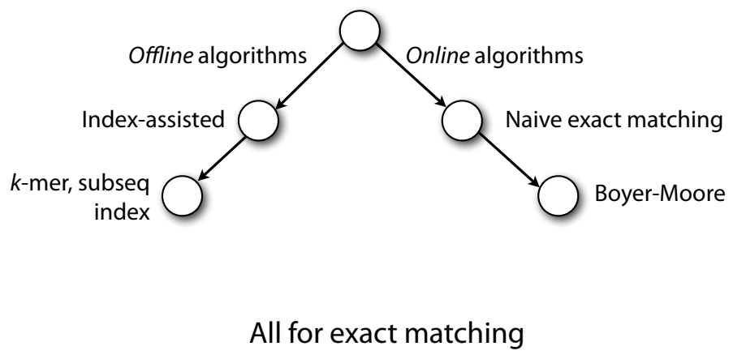

[Course website](https://www.coursera.org/learn/dna-sequencing)

[Youtube playlist](https://www.youtube.com/playlist?list=PL2mpR0RYFQsBiCWVJSvVAO3OJ2t7DzoHA)

[Course Sildes](https://github.com/BenLangmead/ads1-slides)

# Course Note on 'Algorithms for DNA sequencing'

## Part1: Alignment

Chapter1: Exact matching

> 
>
> Algorithm that preprocesses T is offline, otherwise algorithm is online

- Online algorithms: 
  - [naive brute-force algorithm && Boyer-Moore algorithm](part1_exactmatching_1.md)
- Index-assisted offline algorithms: 
  - [k-mer index](part1_exactmatching_2.md)
  - [subseq index](part1_exactmatching_3.md)
    - [Suffix Tree](part1_exactmatching_3_1.md)
    - [FM index](part1_exactmatching_3_2.md)

Chapter2: Approximate matching

- [Preface](part1_approximatematching_1.md)
- [Approaches to carry out approximate matching](part1_approximatematching_2.md)
- [the clever combinations of ideas: index + dynamic programming](part1_approximatematching_3.md)

## Part2: Assembly
