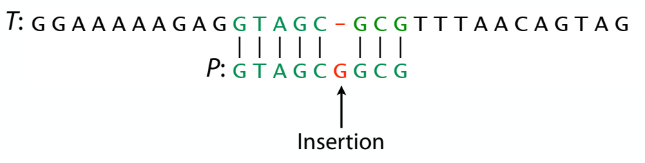

# Reasons we need approximate matching

Differences between read and reference occur because of

1. Sequencing error

2. Natural variation

So, algorithms for eaxct matching are not going to be  sufficient

we need algothms to do approximate matching
    
# Particular kinds of differences

# Quant sequence difference

Hamming distance

Edit distance

