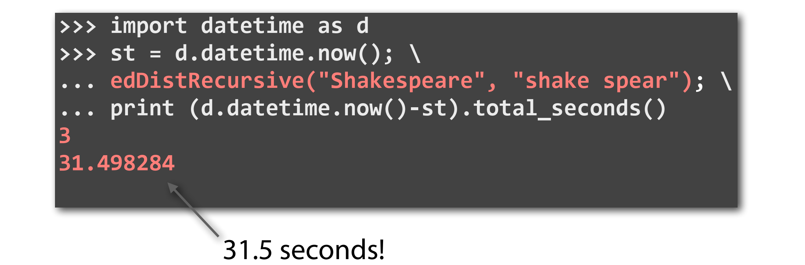

# 1. Modify the initial naive exact matching to carry out approximate matching

# 2. Pigeonhole principle

# 3. Dynamic programming

## 3.1. Original idea

the principle we need to apply:

if we know the edit distance between prefixes of the two strings, we can calculate the edit distance between the entire strings

Modify expression above to get more formal expression

which is a recursive function, and can be coded like following,

## 3.2. Dynamic programming

however it's not smart encough

why does it take such a long time?

because it will generate a quit **large recursive tree**, however, with **much repeates**

that's rather wasteful

there a approach to solve these problem by **remembering** the answer we get, and if later on we make the same exact function call, instead of running this function again, we can aquire the answer we store before easily

💡 That is what we called **dynamic programming**

this kind of algorithm where we decompose the overall problem into smaller problems, while also avoid ever redundantly recaculating

## 3.3. Edit distance for approximate matching

look at the final row, we can find the fewest edits

that tell us that P matches somewhere with 2 edits

we don't know yet is how to figure out exactly where the substring T is that match P with 2 edits

firstly, we have to answer the question that how did we get here

so, in the first step, we came diagonally from above

similar, how did we get this element marked with red box

## 3.4. Use dynamic programming to solve global alignment and local alignment

Call back 'edit distance'

> it penalizes all the different kind of edits that we might find with the same amount, whether it is mismatch, insertion or deletion
>
> so, it's no differece the penalty for insertion versus a substitution, what's more, there is no differece the penalty for substitution that turn an A into C versus substitution that turn an A into T

it's not always make sense to penalize all these differences with the same amount

so what if it turned out for example in practice that gaps were a lot less frequent than substitutions, then it might make sense to penalize the gaps more than the substitutions

        

So remarkably, we barely have to change our edit distance algorithm at all, in order to accommodate this new penalty matrix

when fill in the penalty matrix, only we need to change about this algorithm is to change the value that we get to add on

        
- global alignment

    

- local alignment

    
    
    
    
    it seems pretty difficult compare to edit distance, because we have to somehow consider all possible pairs of substrings from X and Y
    
    but it turn out that there is no a lot difference against global alignment problem
    
    
    
    
    
    if we want to find out that local alignment the one that give the best similarity between 2 substrings, first we're going to look for the element in the matrix with the largest value
    
    
