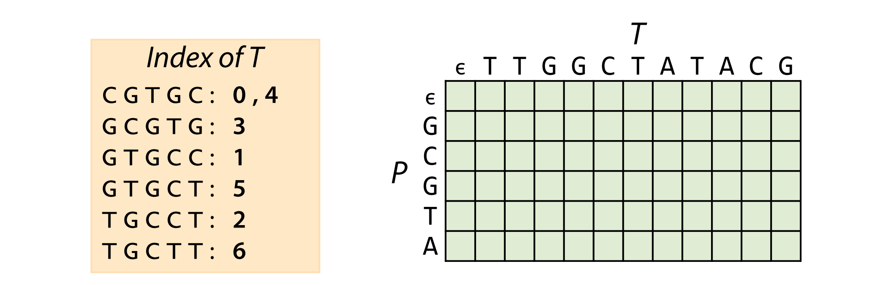
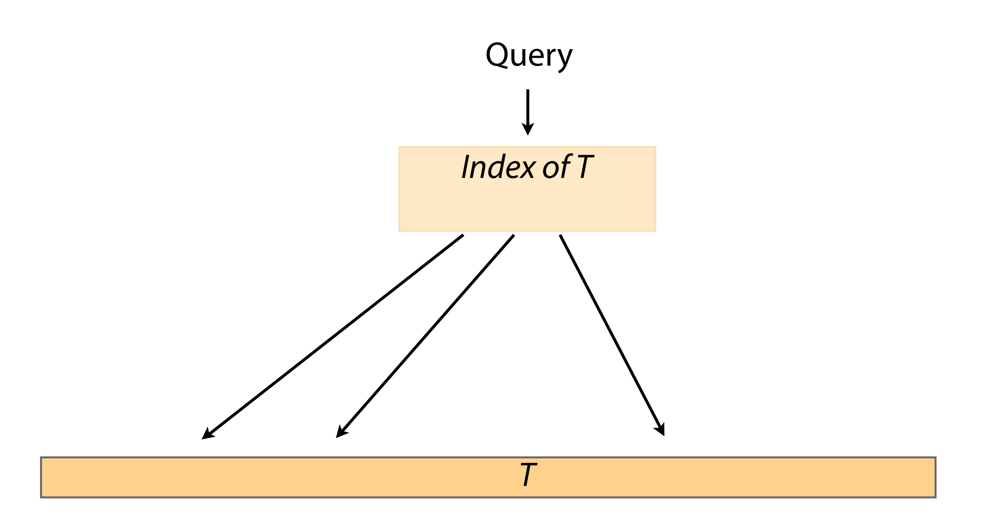
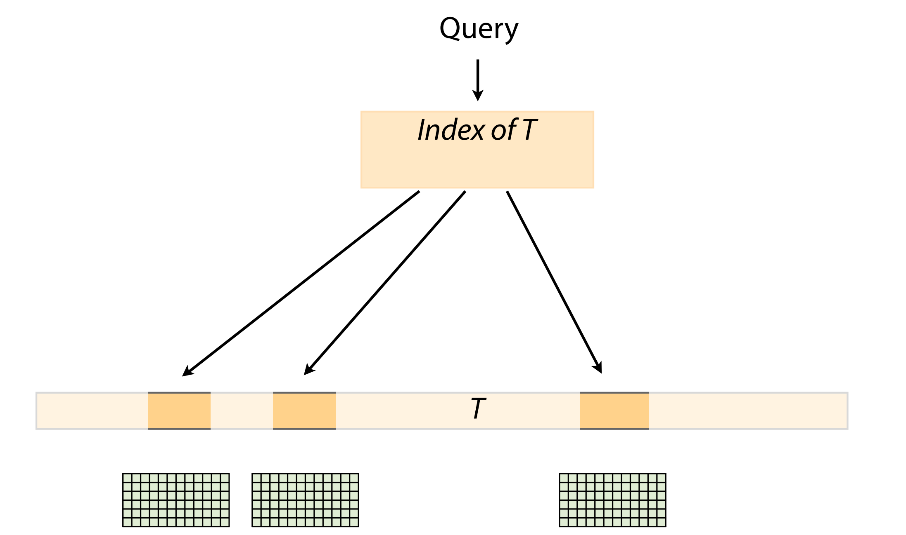

these 2 ideas are quite complementary

the index allow us to rapidly homed in on a small set of candidate locations

after we get the index hits, we only have to look at a few places within the genome carefully with the usage of dynamic programming

why we use dynamic programing? Because the indexs don't deal very well with mismatches and gaps
