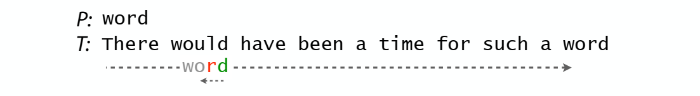

# naive algorithm

# Boyer-Moore: better naïve algorithm

quit similar with naive algorithm, but it is much clever

principle of Boyer-Moore algorithmn

> Learn from character comparisons to skip pointless alignments
>
> Try alignments in left-to-right order, and try character comparisons in right-to-left order
>
> 

Bad character rule

> Upon mismatch, skip alignments until (a) mismatch becomes a match, or (b) P moves past mismatched character
>
> 

Good suffix rule

> Let t = substring matched by inner loop; skip until (a) there are no mismatches between P and t or (b) P moves past t
>
> 

Put 2 rules together

> Use bad character or good suffix rule, whichever skips more
>
> 

Compare with naive algorithm

Preprocess — bulid look-up tables

> Pre-calculate skips. For bad character rule, P = TCGC:
>
> 
