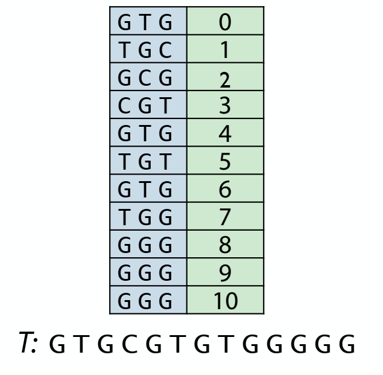

# 1. Online vs. offline


# 2. k-mer index

Build k-mer index


Query index


# 3. Data structure

Abstractly, index is a multimap associating keys (k-mers) with one or more values (offsets)

What data structures allow us to represent and query a multimap?

## 3.1. Ordered structure for indexing: add key-value pairs to an array & sort the array




By using this data structure, we can use binary search for querying index


A useful python module called 'bisect'


```python
import bisect
import sys

class Index(object):
    def __init__(self, t, k):
        ''' Create index from all substrings of size 'length' '''
        self.k = k  # k-mer length (k)
        self.index = []
        for i in range(len(t) - k + 1):  # for each k-mer
            self.index.append((t[i:i+k], i))  # add (k-mer, offset) pair
        self.index.sort()  # alphabetize by k-mer
    
    def query(self, p):
        ''' Return index hits for first k-mer of P '''
        kmer = p[:self.k]  # query with first k-mer
        i = bisect.bisect_left(self.index, (kmer, -1))  # binary search
        hits = []
        while i < len(self.index):  # collect matching index entries
            if self.index[i][0] != kmer:
                break
            hits.append(self.index[i][1])
            i += 1
        return hits[:]

def queryIndex(p, t, index):
    k = index.k
    offsets = []
    for i in index.query(p):
        if p[k:] == t[i+k:i+len(p)]:  # verify that rest of P matches
            offsets.append(i)
    return offsets

t = 'ACTTGGAGATCTTTGAGGCTAGGTATTCGGGATCGAAGCTCATTTCGGGGATCGATTACGATATGGTGGGTATTCGGGA'
p = 'GGTATTCGGGA'
index = Index(t, 4)
print(queryIndex(p, t, index))
[21, 68]
```
 
## 3.2. Hash table as multimap


```python
import bisect
import sys

class Index(object):
    def __init__(self, t, k):
        ''' Create index from all substrings of size 'length' '''
        self.k = k  # k-mer length (k)
        self.index = {}
        for i in range(len(t) - k + 1):  # for each k-mer
            kmer = t[i:i+k]
            if kmer not in self.index:
                self.index[kmer] = [i]
            else:
                self.index[kmer].append(i)
            # could also have used collections.defaultdict
    
    def query(self, p):
        ''' Return index hits for first k-mer of P '''
        kmer = p[:self.k]  # query with first k-mer
        return self.index.get(kmer, [])[:]

def queryIndex(p, t, index):
    k = index.k
    offsets = []
    for i in index.query(p):
        if p[k:] == t[i+k:i+len(p)]:  # verify that rest of P matches
            offsets.append(i)
    return offsets

t = 'ACTTGGAGATCTTTGAGGCTAGGTATTCGGGATCGAAGCTCATTTCGGGGATCGATTACGATATGGTGGGTATTCGGGA'
p = 'GGTATTCGGGA'
index = Index(t, 4)
print(queryIndex(p, t, index))
[21, 68]
```

## 4. Variation on k-mer index

- remove odd offsets

    
    
    advantages:
    
    the index now is smaller, take up less memory, it is also a little faster to query
    
    you may wonder if it will cause us to miss some of the matches ?
    
    
    
    mostly it would be solved by another indexes
    
    

- all the different offsets on multiple 3

    

- indexing for subsequences

    
    
    
    
    
    
    advantage: it tends to increase the specificity of the filter provided by the index
