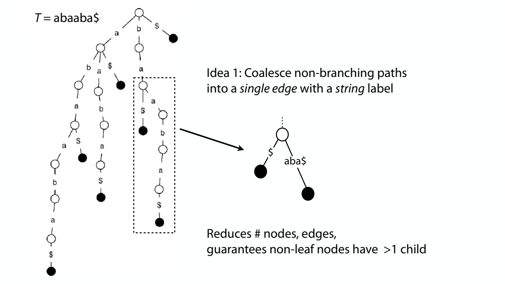

# 1. Tries

A trie (“try”) is a tree representing a collection of strings (keys): the smallest tree such that

> Each edge is labeled with a character $c \in \Sigma$
>
> For given node, at most one child edge has label c, for any $c \in \Sigma$
>
> Each key is “spelled out” along some path starting at root

Helpful for implementing a set or map when the keys are strings


How do we check whether “infer” is in the trie?

Start at root and try to match successive characters of “infer” to edges in trie


Matching “interesting”


Matching “insta”


Checking for presence of key P, where | P | = n traverses ≤ n edges

If total length of all keys is N, trie has ≤ N edges

How to represent edges between a node and its children?

> Map (from characters to child nodes)
>
> Idea 1: Hash table
>
> Idea 2: Sorted lists

Assuming hash table, it’s reasonable to say querying with P, | P | = n, is O(n) time

Could use trie to represent k-mer index. Map k-mers to offsets where they occur


```python
class TrieMap(object):
    """ Trie implementation of a map.  Associating keys (strings or other
        sequence type) with values.  Values can be any type. """
    
    def __init__(self, kvs):
        self.root = {}
        # For each key (string)/value pair
        for (k, v) in kvs: self.add(k, v)
    
    def add(self, k, v):
        """ Add a key-value pair """
        cur = self.root
        for c in k: # for each character in the string
            if c not in cur:
                cur[c] = {} # if not there, make new edge on character c
            cur = cur[c]
        cur['value'] = v # at the end of the path, add the value
    
    def query(self, k):
        """ Given key, return associated value or None """
        cur = self.root
        for c in k:
            if c not in cur:
                return None # key wasn't in the trie
            cur = cur[c]
        # get value, or None if there's no value associated with this node
        return cur.get('value')

>> mp = TrieMap([("hello", "value 1"), ("there", 2), ("the", "value 3")])
>> mp.query("hello")
'value 1'
```
    
# 2. Suffix tries

## 2.1. How can we build a trie containing all suffixes of a text T

First add special terminal character \$ to the end of T

\$ is a character that does not appear elsewhere in T, and we define it to be less than other characters (\$ < A < C < G < T)


 ```python
 def __init__(self, t):
	""" Make suffix trie from t """
	t += '$'  # terminator symbol
	self.root = {}
	for i in range(len(t)):  # for each suffix
		cur = self.root
		for c in t[i:]:  # for each character in i'th suffix
			if c not in cur:
				cur[c] = {}  # add outgoing edge if necessary
			cur = cur[c]
```

## 2.2. How do we check whether a string S is a substring of T?

Start at the root and follow the edges labeled with the characters of S

If we “fall off” the trie -- i.e. there is no outgoing edge for next character of S, then S is not a substring of T

If we exhaust S without falling off, S is a substring of T


```python
def follow_path(self, s):
	""" Follow path given by characters of s.  Return node at
	end of path, or None if we fall off. """
	cur = self.root
	for c in s:
		if c not in cur:
			return None  # no outgoing edge on next character
		cur = cur[c]  # descend one level
	return cur

def has_substring(self, s):
	""" Return true if s appears as a substring of t """
	return self.follow_path(s) is not None
```

## 2.3. How do we check whether a string S is a **suffix** of T?

Same procedure as for substring, but additionally check terminal node for $ child


```python
def has_suffix(self, s):
    """ Return true if s is a suffix of t """
    node = self.follow_path(s)
    return node is not None and '$' in node
```
        
## 2.4. How do we count the number of times a string S occurs as a substring of T?

Follow path labeled with S

If we fall off, answer is 0

If we end up at node n, answer equals # of leaves in subtree rooted at n

Leaves can be counted with depth-first traversal


 
## 2.5. How do we find the longest repeated substring of T?

Find the deepest node with more than one child


## 2.6. How does the suffix trie grow with | T | = m ?

the number of suffix trie nodes grows linearly with m


the number of suffix trie nodes grows with $m^2$


        
# 3. Suffix trees


    
❓ How to make Suffix trie smaller
    
- Idea 1: Coalesce non-branching paths into a single edge with a string label

    
    
    
    
    

- Idea 2: Store T itself in addition to the tree. Convert tree’s edge labels to **(offset, length)** pairs with respect to T

    
    
    Space is now O(m) Suffix trie was O(m2)!
    
    leaves hold offsets
    
    
    
    


    
## 3.1. build Suffix tree


```python
class SuffixTree(object):
    
    class Node(object):
        def __init__(self, lab):
            self.lab = lab # label on path leading to this node
            self.out = {}  # outgoing edges; maps characters to nodes
    
    def __init__(self, s):
        """ Make suffix tree, without suffix links, from s in quadratic time
            and linear space """
        s += '$'
        self.root = self.Node(None)
        self.root.out[s[0]] = self.Node(s) # trie for just longest suf
        # add the rest of the suffixes, from longest to shortest
        for i in range(1, len(s)):
            # start at root; we’ll walk down as far as we can go
            cur = self.root
            j = i
            while j < len(s):
                if s[j] in cur.out:
                    child = cur.out[s[j]]
                    lab = child.lab
                    # Walk along edge until we exhaust edge label or
                    # until we mismatch
                    k = j+1 
                    while k-j < len(lab) and s[k] == lab[k-j]:
                        k += 1
                    if k-j == len(lab):
                        cur = child # we exhausted the edge
                        j = k
                    else:
                        # we fell off in middle of edge
                        cExist, cNew = lab[k-j], s[k]
                        # create “mid”: new node bisecting edge
                        mid = self.Node(lab[:k-j])
                        mid.out[cNew] = self.Node(s[k:])
                        # original child becomes mid’s child
                        mid.out[cExist] = child
                        # original child’s label is curtailed
                        child.lab = lab[k-j:]
                        # mid becomes new child of original parent
                        cur.out[s[j]] = mid
                else:
                    # Fell off tree at a node: make new edge hanging off it
                    cur.out[s[j]] = self.Node(s[j:])
    
    def followPath(self, s):
        """ Follow path given by s.  If we fall off tree, return None.  If we
            finish mid-edge, return (node, offset) where 'node' is child and
            'offset' is label offset.  If we finish on a node, return (node,
            None). """
        cur = self.root
        i = 0
        while i < len(s):
            c = s[i]
            if c not in cur.out:
                return (None, None) # fell off at a node
            child = cur.out[s[i]]
            lab = child.lab
            j = i+1
            while j-i < len(lab) and j < len(s) and s[j] == lab[j-i]:
                j += 1
            if j-i == len(lab):
                cur = child # exhausted edge
                i = j
            elif j == len(s):
                return (child, j-i) # exhausted query string in middle of edge
            else:
                return (None, None) # fell off in the middle of the edge
        return (cur, None) # exhausted query string at internal node
    
    def hasSubstring(self, s):
        """ Return true iff s appears as a substring """
        node, off = self.followPath(s)
        return node is not None
    
    def hasSuffix(self, s):
        """ Return true iff s is a suffix """
        node, off = self.followPath(s)
        if node is None:
            return False # fell off the tree
        if off is None:
            # finished on top of a node
            return '$' in node.out
        else:
            # finished at offset 'off' within an edge leading to 'node'
            return node.lab[off] == '$'

>> stree = SuffixTree('there would have been a time for such a word')
>> stree.hasSubstring('nope')
False
>> stree.hasSubstring('would have been')
True
>> stree.hasSuffix('would have been')
False
>> stree.hasSuffix('such a word')
True
```

Canonical method: Ukkonen’s algorithm

O(m) time and space!

Won’t cover it in class; see Gusfield Ch. 6 for details

## 3.2. search in Suffix tree


## 3.3. Suffix tree application

- find longest common substring

    Find longest common substring (LCS) of X and Y, make a new string X#Y$ where #, $ are both terminal symbols
    
    Build a suffix tree for X#Y$
    
    X = xabxa
    
    Y = babxba
    
    X#Y$ = xabxa#babxba$
    
    
    
    For clarity, if a suffix includes part of both strings, let's hide the portion after the #
    
    
    
    Now suffixes of X end in # and suffixes of Y end in $
    
    
        
- generalized suffix trees

    

- Suffix trees in the real world

    
