## Overlap graphs — a way of representing all the overlaps in a data structure

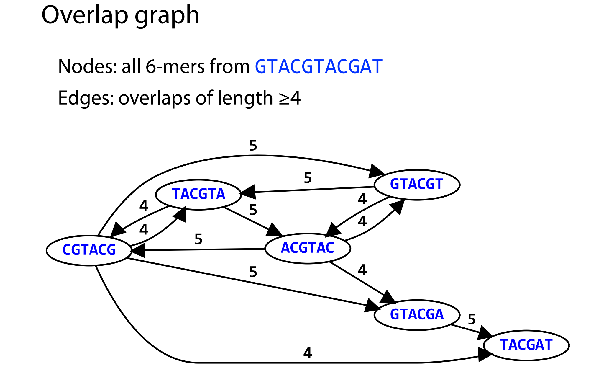

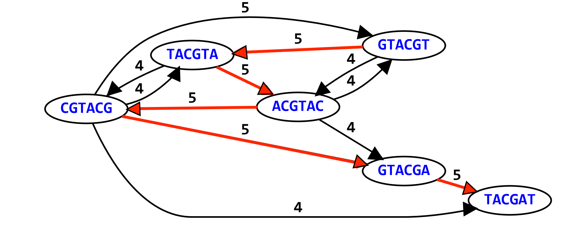

## Method to deal with overlap graph: Shortest common superstring problem

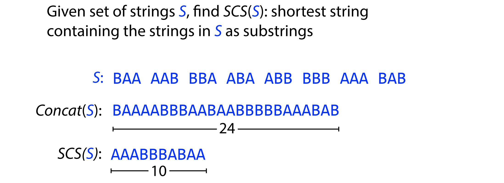

we can regard the assembly problem as a task to find the shortest common superstring in overall overlap graphs

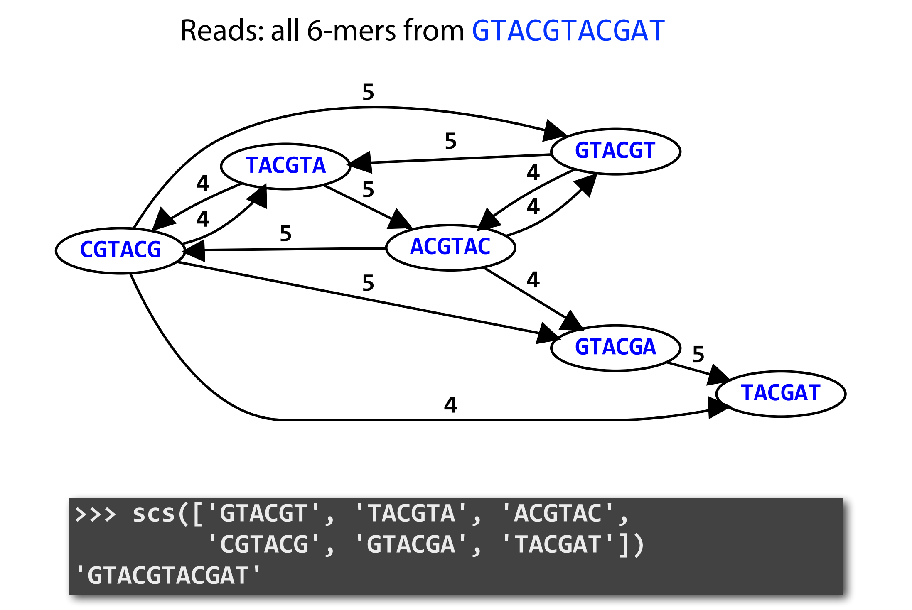

however, the shortest common superstring problem also has some substantial downsides

NP-complete: no efficient algorithms for large inputs

### Original brute force method

Idea: pick order for strings in S and construct superstring

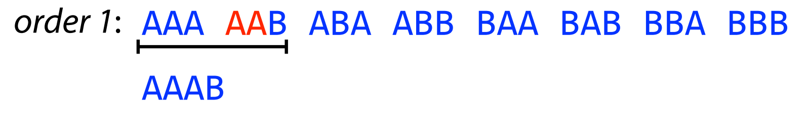

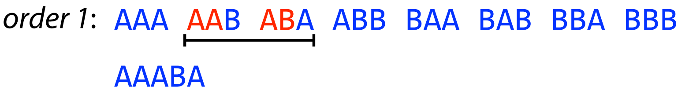

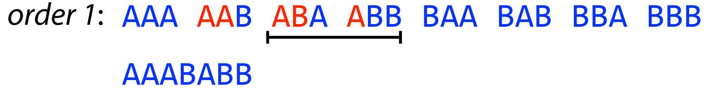

...
        
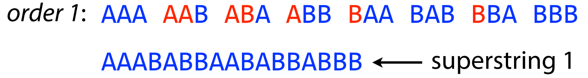

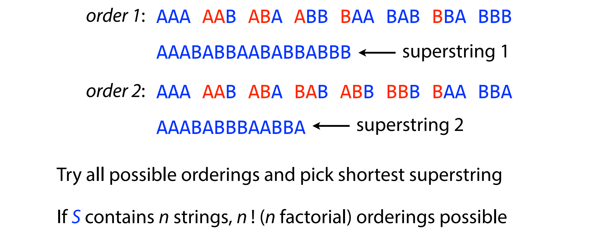

### Greedy shortest common superstring

greedy algorithm

make a series decisions, and at each decision point, it will chose the option that reduce the length of the eventual superstring at most

however it can not make sure to get optimal solution

a case of greedy shortest common superstring

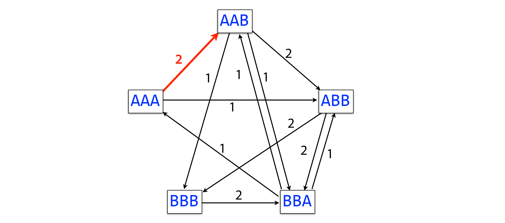

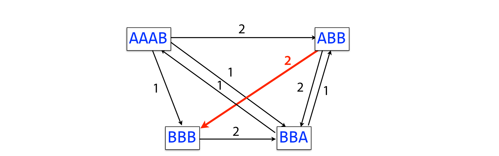

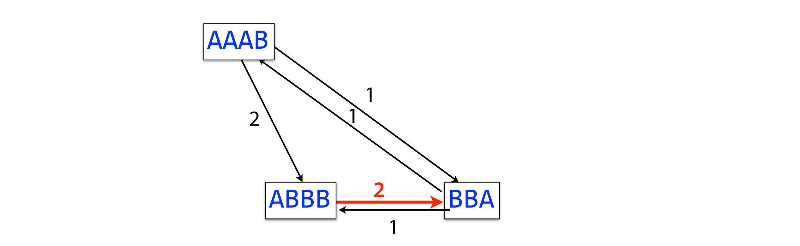

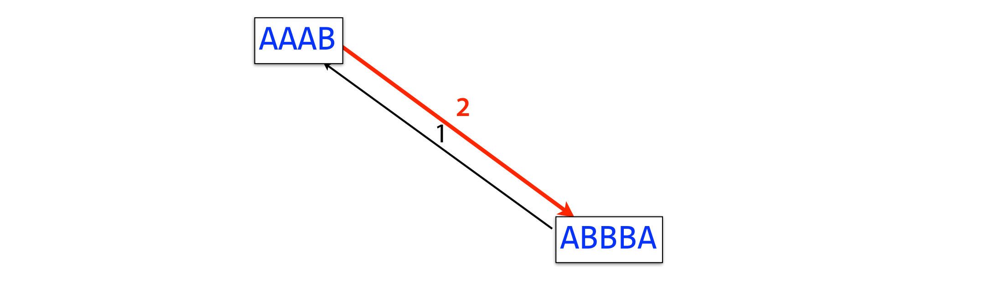

it is not the shortest common superstring

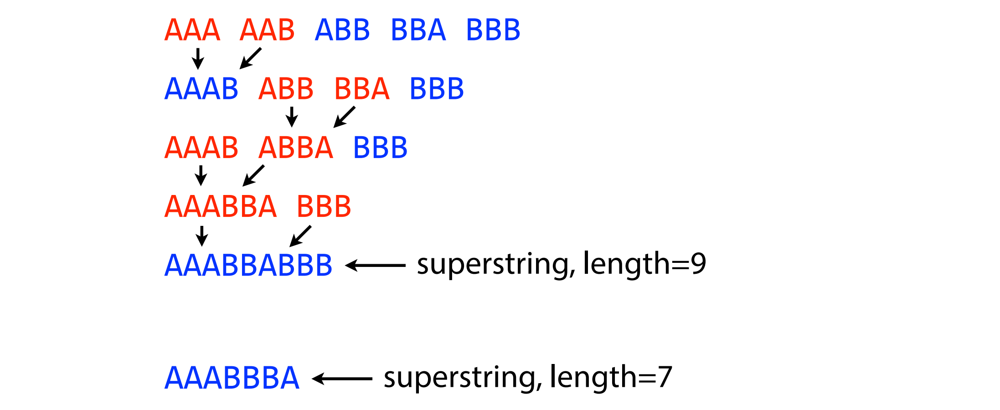

## Third law of assembly: repeats is bad, make assembly difficult
    
the shortest common superstring is not the correct answer when genome is repeatitive

- (1) collapse repetitive regions into fewer copies

    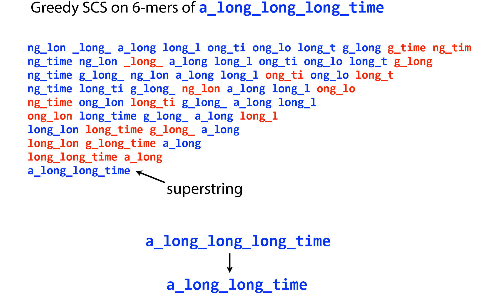

    why did that happen?

    the problem here is that find the shortest common superstring isn't really what we want

    because the genome is repetitive, finding the shortest common superstring will tend to take the repetitive portions of the genome and collapse down into fewer coyies

    when look at the reads original from genome with repetitive elements, we cann't tell how many coyies there are, we can only tell there are at least two cpyies

- (2) switch error for 2 distant genome regions

    
        
## Alternative algorithm to deal with repeats: de Bruijn graph and Eulerian walk

### de Bruijn graph

assumptions:

the sequencing read we getting consist of each substring of genome with length K

each k-mer is sequenced once

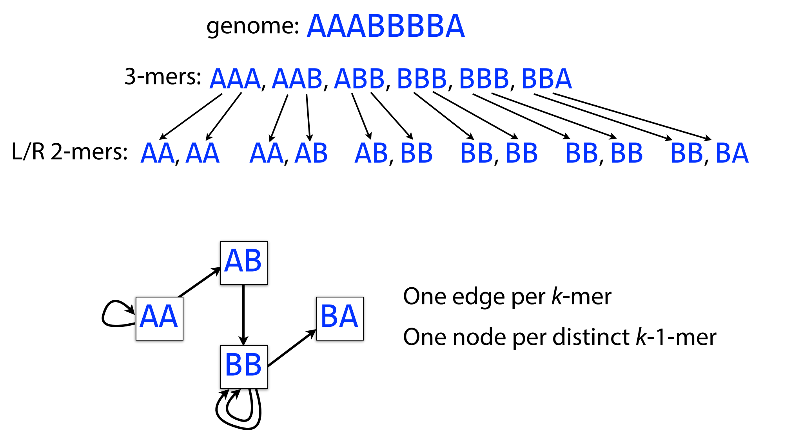

### Eulerian walk

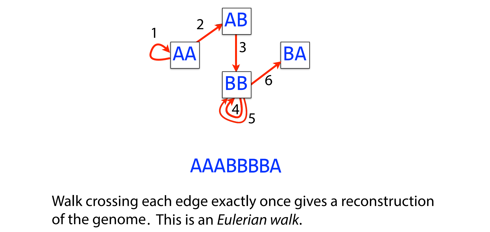

### Whether it actually solved the issue we had with the shortes common superstring?

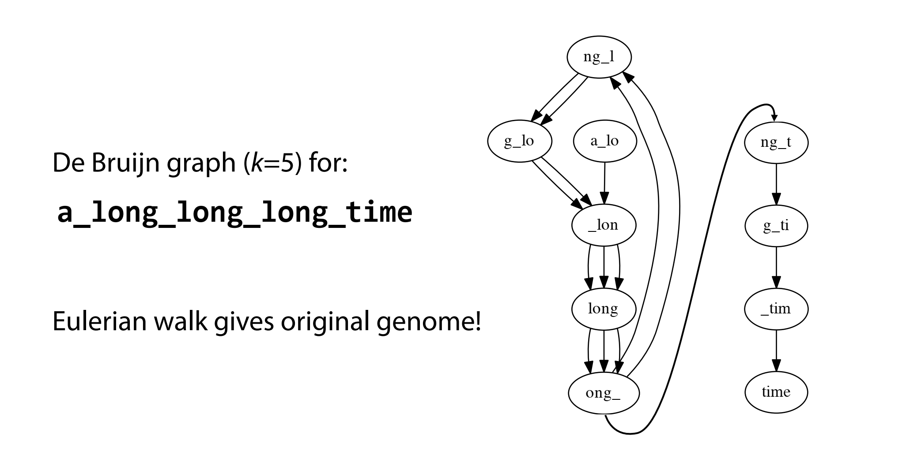

however, it cann't deal with all assembly difficluty owing to repeats

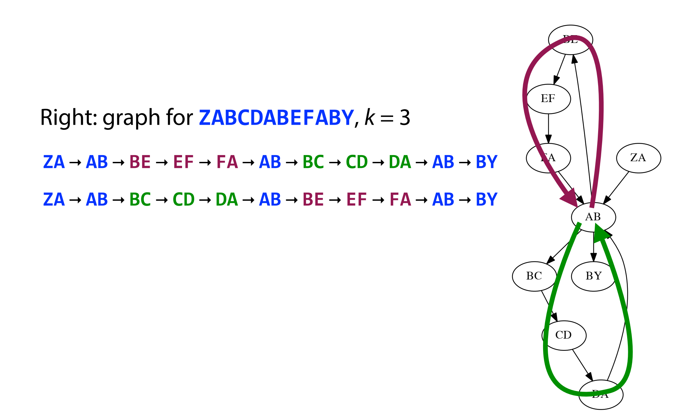

we find 2 different ways of Eulerian walk

we can use longer k-mer to deal with this issue

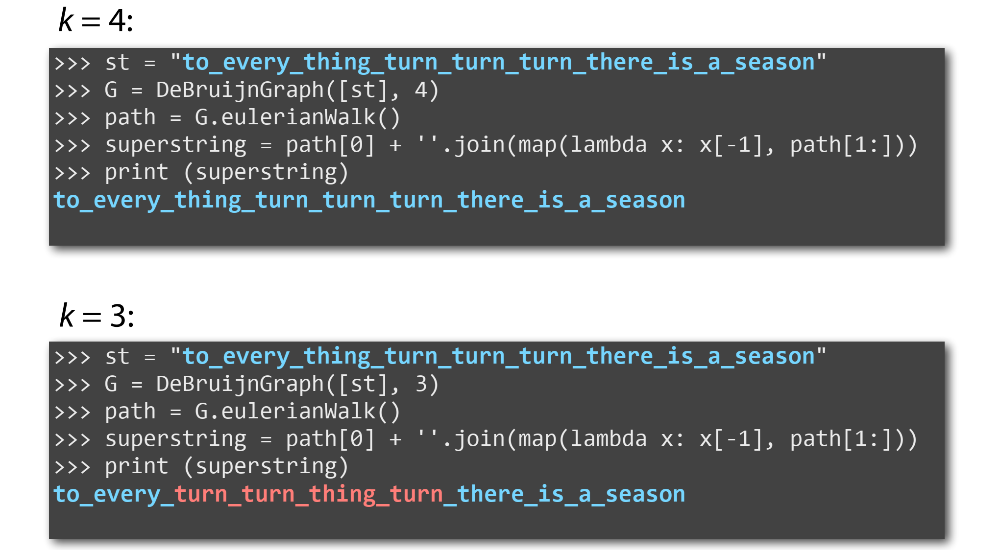

### the assumption each k-mer sequenced once is not realist

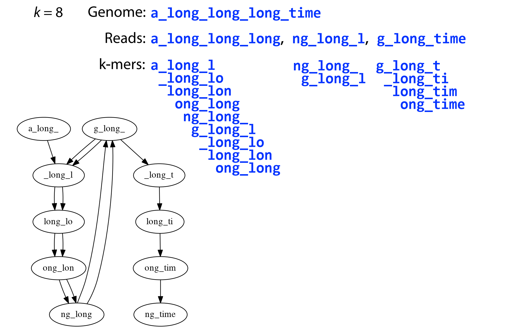

it makes the de bruijn graph not eulerian, but almost eulerian

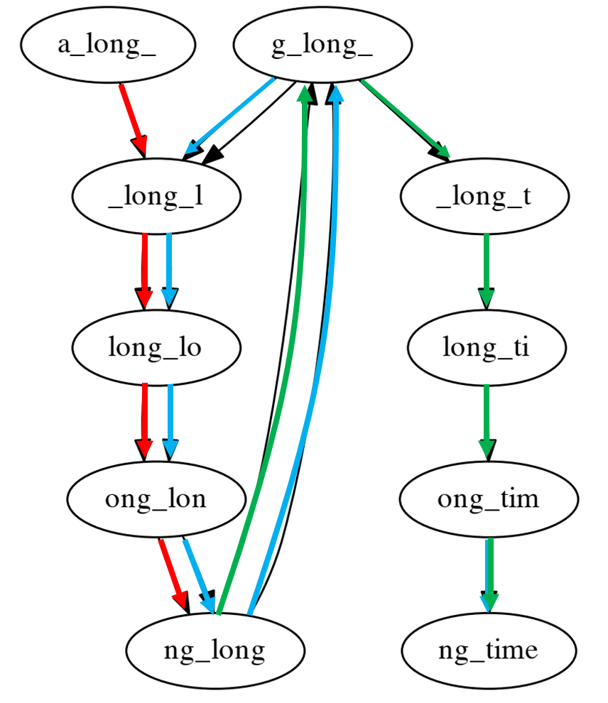
        
so find eulerian walk will not always solve the assembly problem