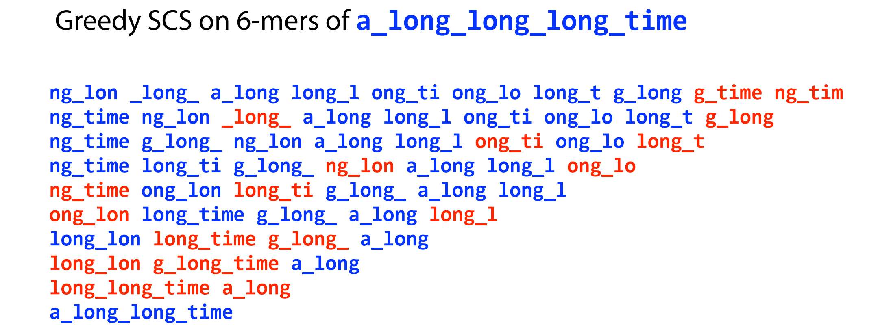
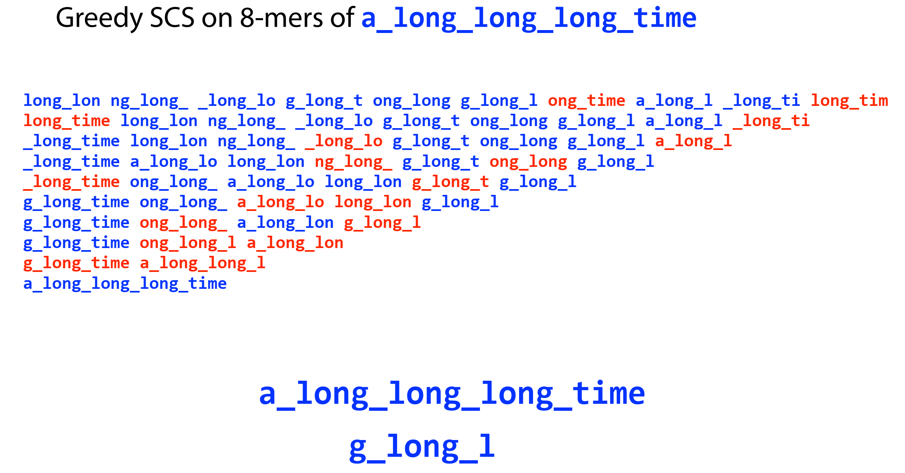
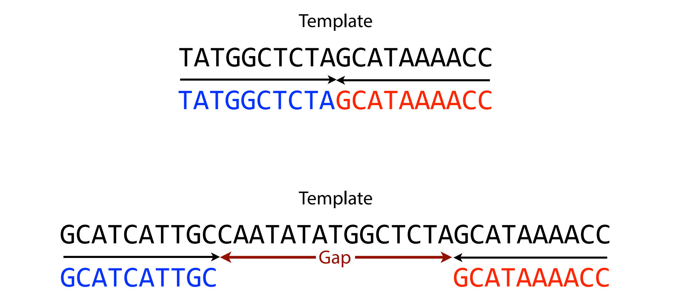

# Longer reads can deal with 3rd law of assembly

because the longer the reads are, the more likely we are to get a read that anchors some repetitive sequence that glues it with some surrounding non repetitive sequence

that will tell us where the repetitive sequence from

    
(1) longer reads prevent us from collapsing a repeat
    

    

the reason why 8-mer out-performance to 6-mer is that, it will **construct a important 8-mer to span repetitive region**, which can tell us there are at least 3 repetitive elements

# How do we get longer reads

paired-end sequencing

recent development technologies — single molecular sequencing

