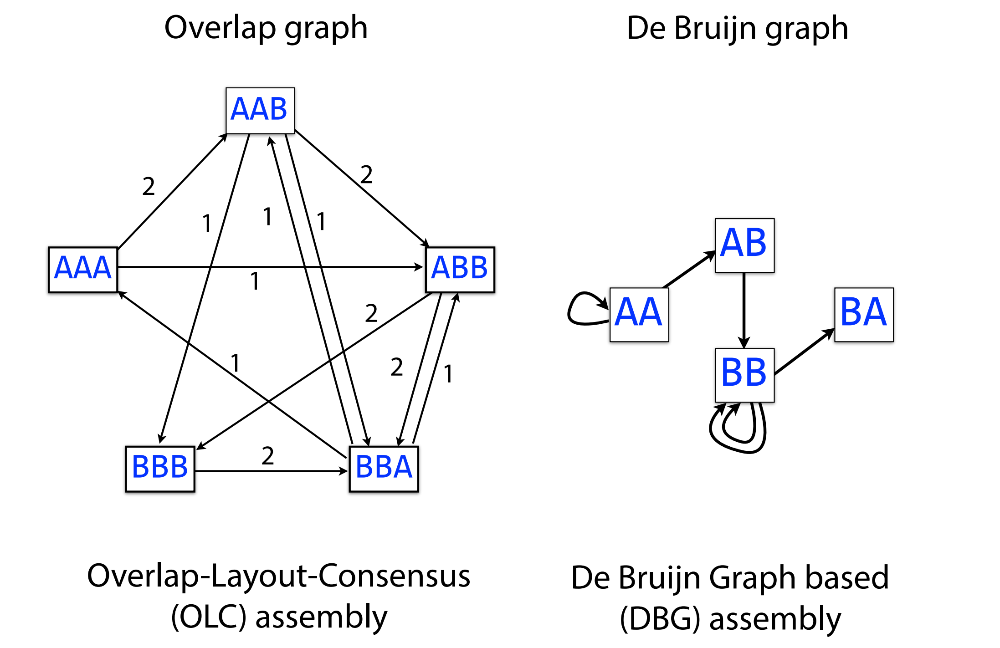
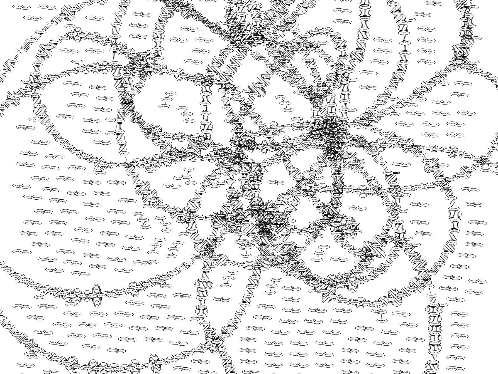
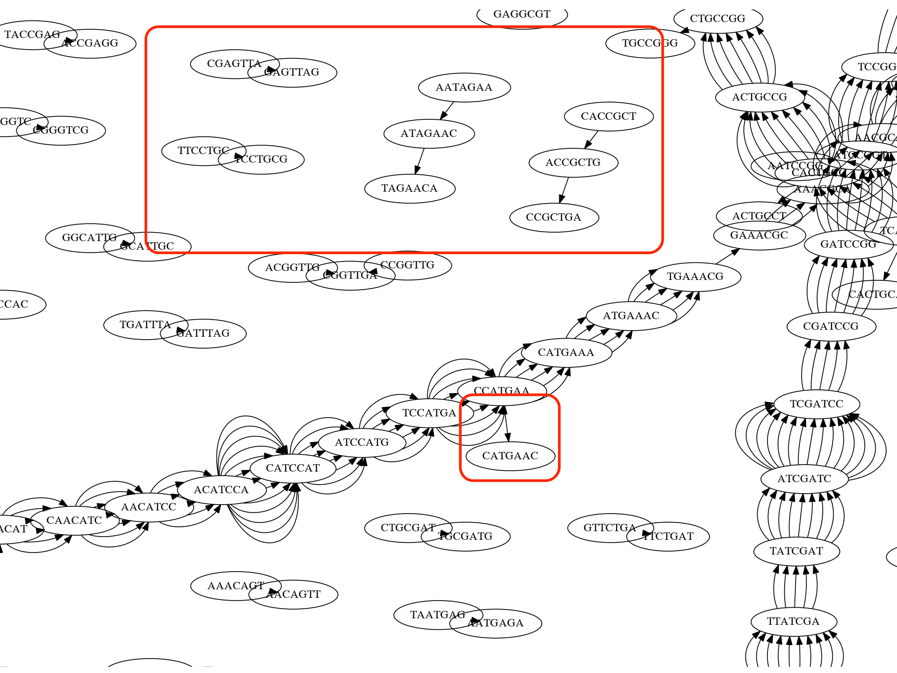
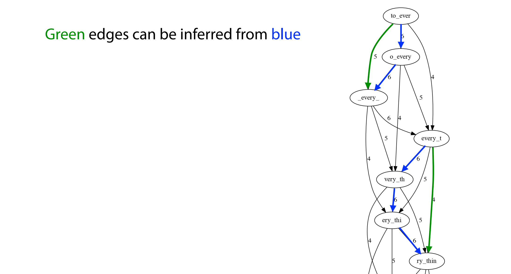
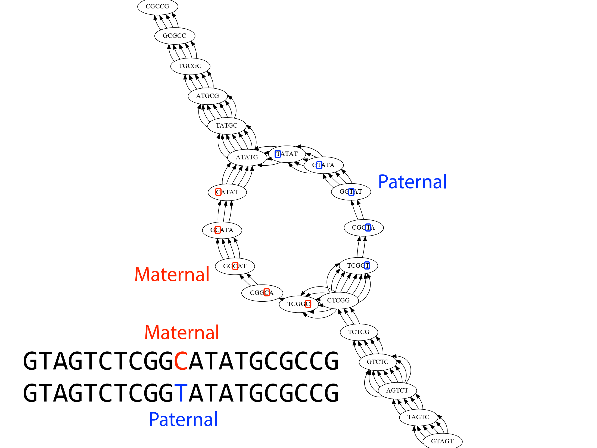
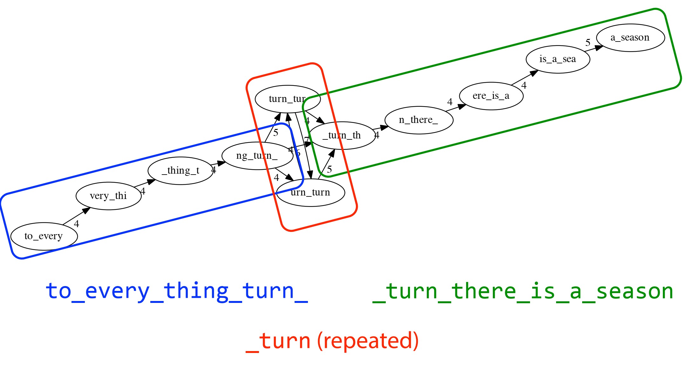
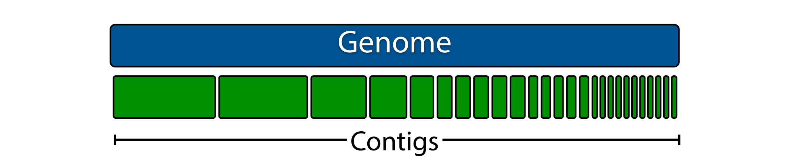
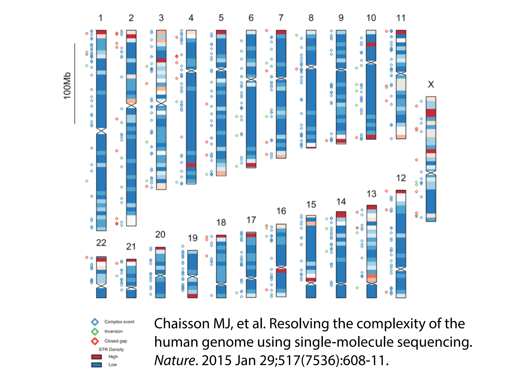

in fact, the graph is big and messy

why is the graph so messy?

- (1) sequencing errors
    
    sequencing errors can introduce sort of spurious division in the graph, and dead ends
    
    
    
- (2) redudant edges (specific to overlap graph)
    
    
    
- (3) polyploidy: can simplify graph by collapsing bobles
    
    
    
- (4) repeats
    
    
    
    so basically, we deal with it by chopping the assembly and pieces
    
    so in the end of day, instead of reporting a single assembly genome sequence, an assembler will report a set of contigs
    
    
    

