# 1. Background on Cancer Genome Alterations

## 1.1. Genomic alterations in cancer: drivers vs passengers, somatic vs germline

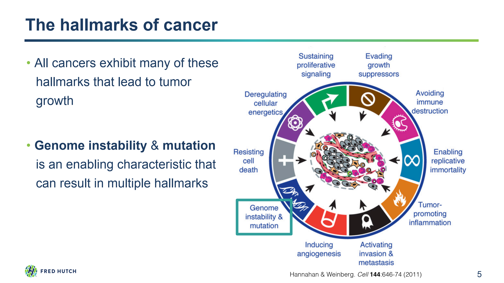

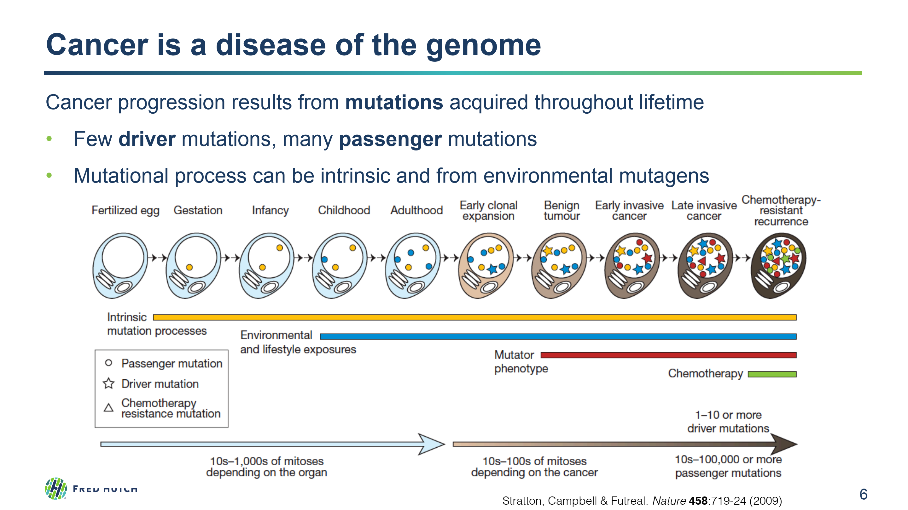

## 1.2. Types of Genomic Variation

Small/Short mutations

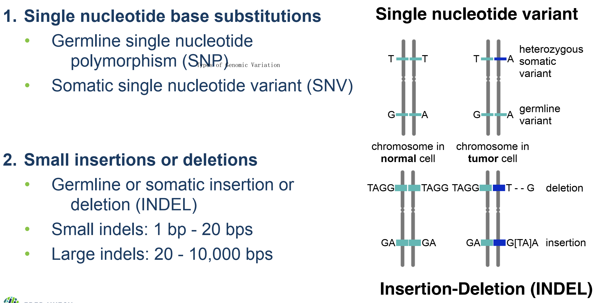

Large alterations
            
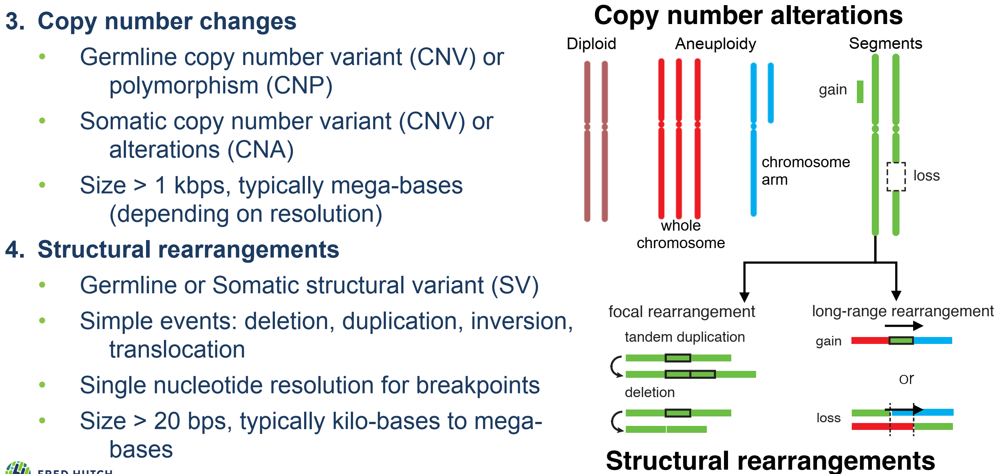
            
## 1.3. Tumor evolution and heterogeneity

Tumors exhibit different levels of heterogeneity

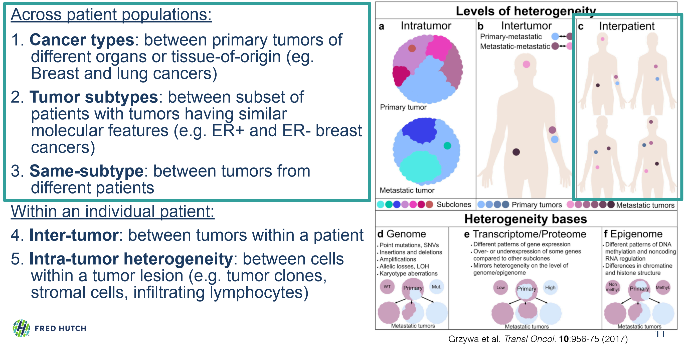

How do we find the mutated genes that drive cancer?

- Significantly Mutated Genes: recurrently mutated genes in patient cohorts
- Account for covariates (e.g. gene length, expression, replication timing)

    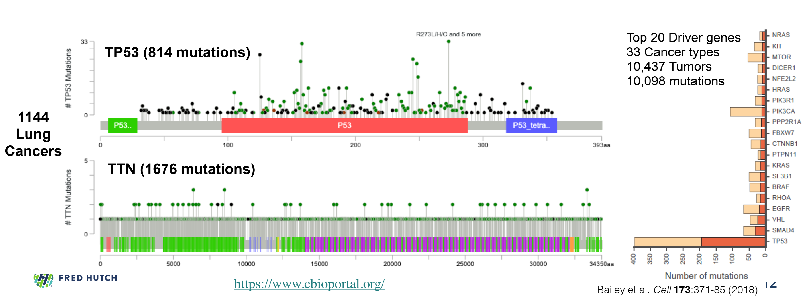
        
Tumors undergo genome evolution and clonal expansion

- Clonal diversity may have implications for treatment resistance
- Dynamics of clones can change in the blood and metastases
    
    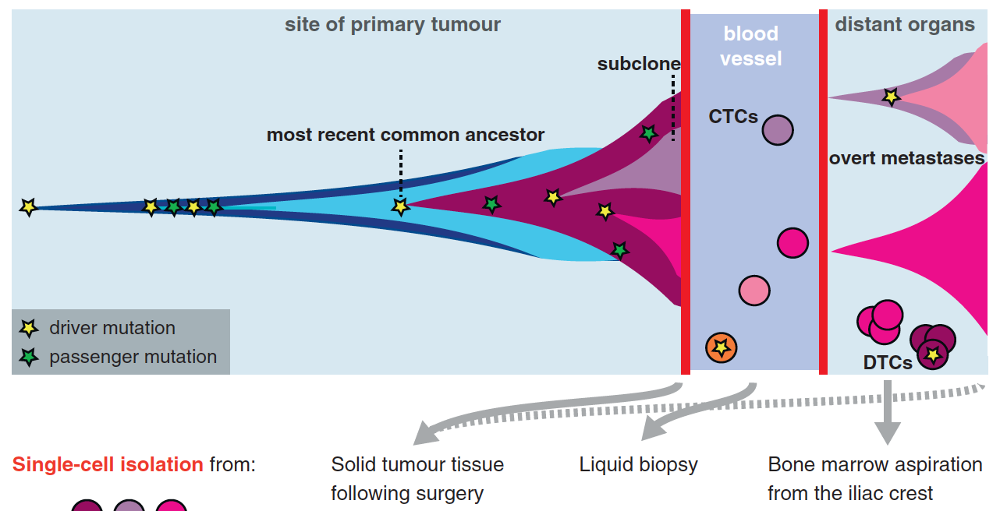
    
    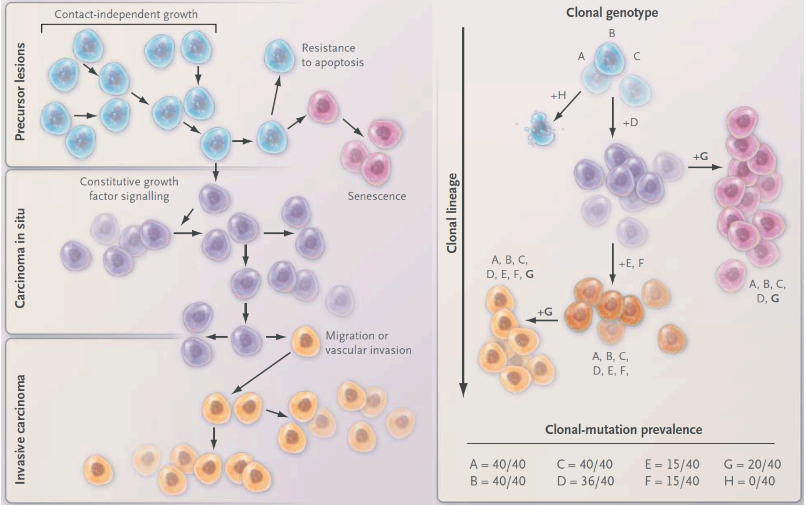
        
Inferring intra-tumor genomic heterogeneity from sequencing

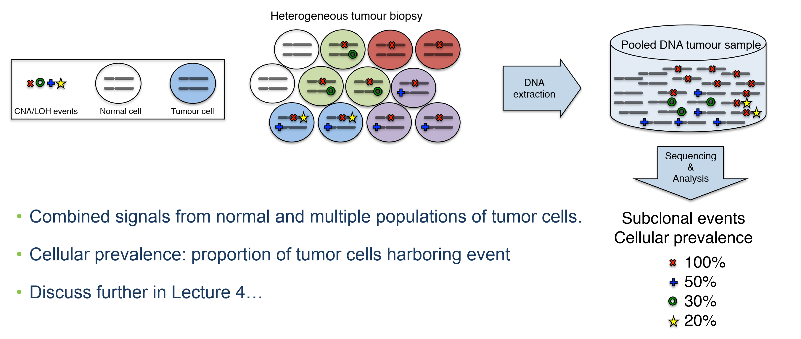

Inferring evolutionary history of a tumor from sequencing

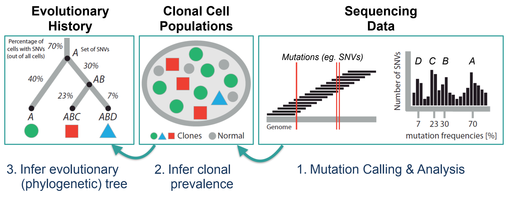
        
# 2. Overview of Cancer Genome Analysis

## 2.1. General Workflow of Tumor Genome Sequencing

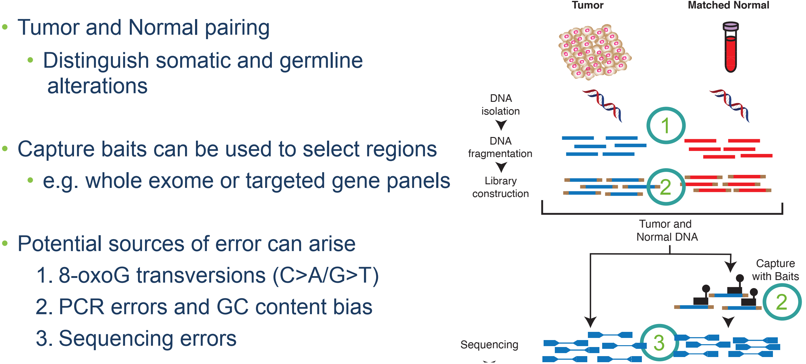

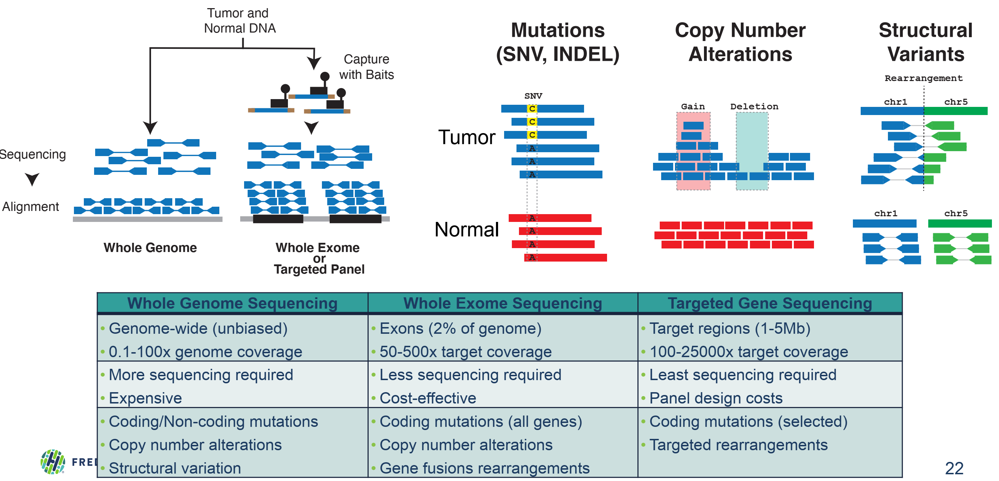
        
## 2.2. International Consortia & Projects

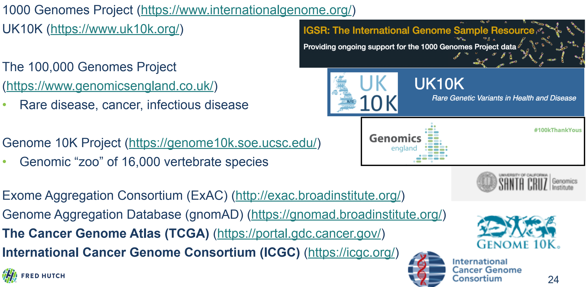
        
## 2.3. Sequence vs Physical Coverage

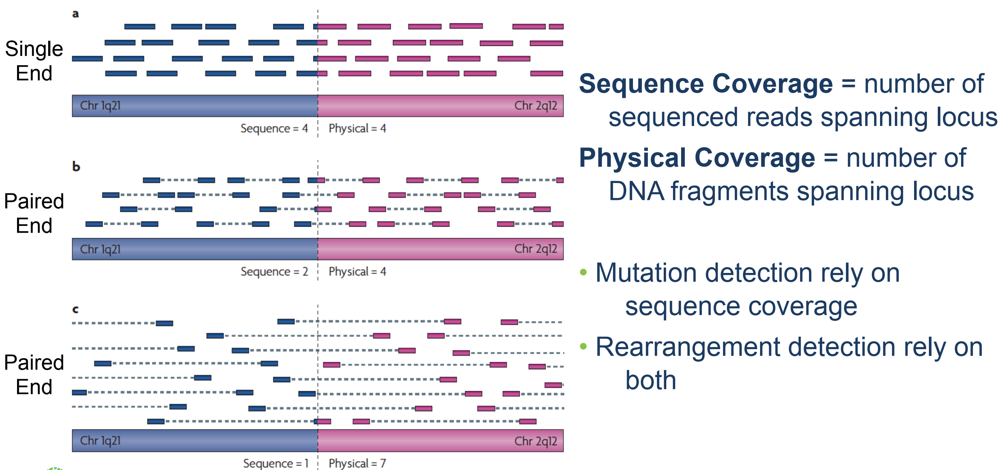
        
# 3. Primer on statistical modeling

## 3.1. Sequencing Data Analysis Requires Probabilistic Models

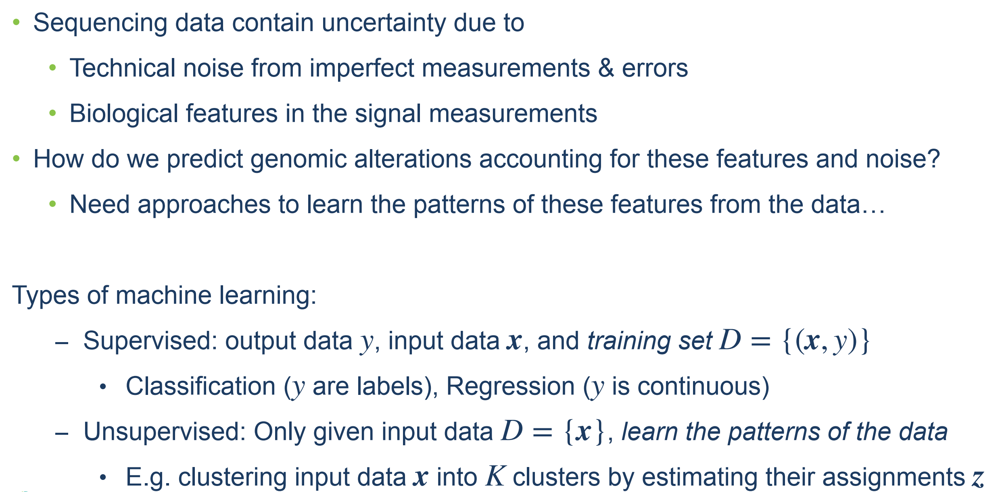
 
## 3.2. Probability distribution, Bayesian statistics, inference

Primer: Probability Theory

Probability distribution: Binomial

Bayesian Statistics

- Binomial likelihood model: probability of heads $\mu$
        
    $$
    P(x_{1:T} \mid N_{1:T}, \mu) = \prod_i^T \text{Bin}(x_i \mid N_i, \mu) 
    $$
    
    We can estimate this model parameter using Maximum Likelihood Estimation (**MLE**)
    
- Prior Distribution for binomial parameter, $\mu \sim \text{Beta}(\alpha,\beta)$
    
    Beta is a **conjugate prior** for the binomial
        
    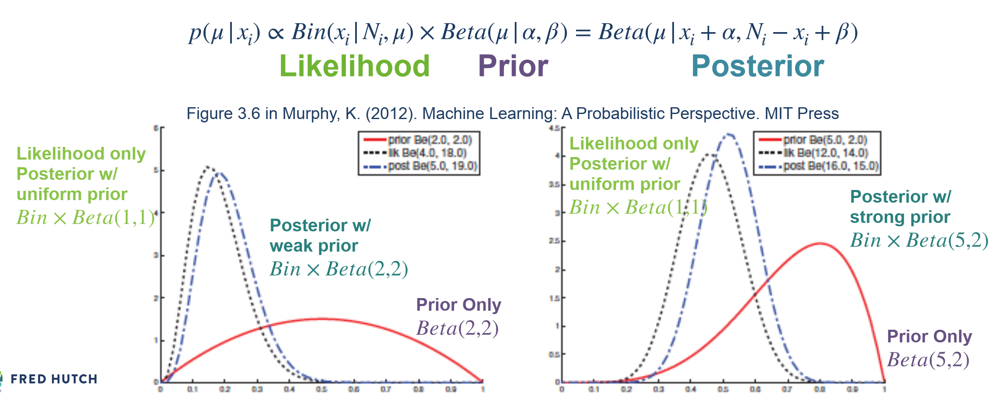
        
Then we get Beta-Binomial Model

From the posterior, we can estimate the parameter using the maximum a posteriori (**MAP**), $\hat \mu_{\text{MAP}}$

$$
p(\mu \mid x_i ) \propto \text{Bin}(x_i \mid N_i, \mu) \cdot \text{Beta}(\mu \mid \alpha, \beta) \\ = \text{Beta}(\mu \mid x_i + \alpha, N_i - x_i + \beta) \\ \downarrow \\ \text{let } \alpha' = x_i + \alpha, \beta'=N_i - x_i + \beta \\ \downarrow \\ p(\mu \mid x_i ) \propto \text{Beta}(\mu \mid \alpha', \beta')\\ \hat \mu_{\text{MAP}} = \frac{\alpha'-1}{\alpha' + \beta' -2}
$$
 
## 3.3. Mixture models and inference using the EM algorithm
        
### Binomail Mixture Model
        
- Referee example with multiple coins
            
    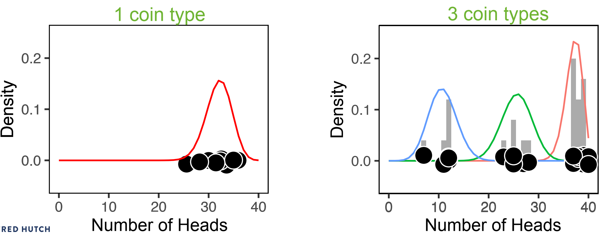
    
    Each referee draws one coin from a hat that contains a bunch of these coin types **mixed together**
    
    1. We don't know the proportion of each coin type in the hat.
            
    2. We don’t know which coin each referee drew from the hat.
    
    3. We don't know the fairness (probability of heads) for each type of coin
    
    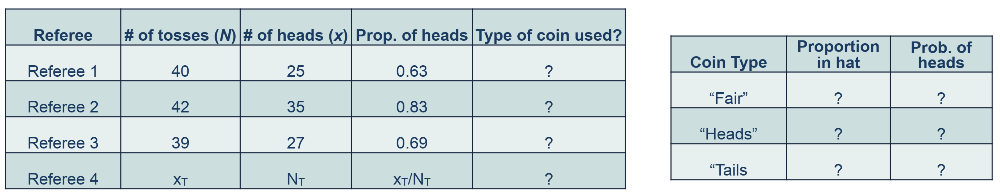
    
    1. What is the proportion of each coin type in the hat?
    
        Find the probability for drawing a coin type
    
        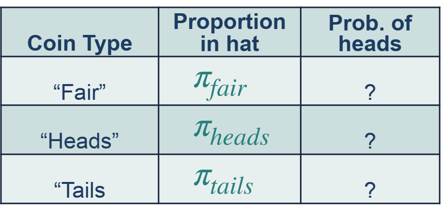
    
        $\pi = (\pi_{\text{Fair}}, \pi_{\text{Heads}}, \pi_{\text{Tails}})$ are the mixture weights where $\sum_{k}^K \pi_k = 1$
    
    2. Which coin did each referee draw?
        
        Define the latent variables
        
        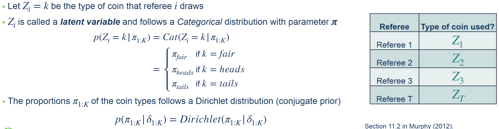
    
    3. What is the fairness (prob. of heads) for each type of coin?
        
        Find the probability of heads for each coin type
        
        for a single coin, $p(x_i \mid N_i, \mu) = Bin(x_i \mid N_i, \mu)$
        
        Define the likelihood for a 3-component mixture of binomials with 3 parameters, $\mu_{\text{Fair}}, \mu_{\text{Heads}}, \mu_{\text{Tails}}$, one for each type of coin
        
        $$
        p(x_i \mid N_i, \mu_{1:K}, \pi_{1:K}) = \sum_{k}^K \pi_k \cdot Bin(x_i \mid N_i, \mu_k)
        $$
            
- Inference & parameter estimation using EM

    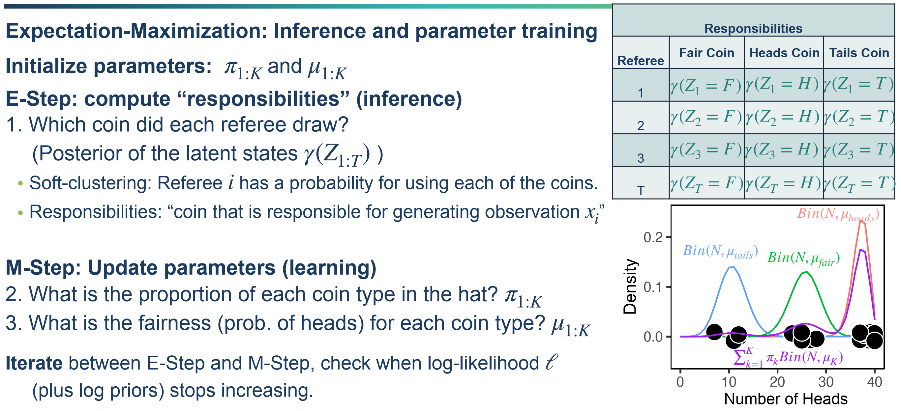
    
    - E-Step: compute responsibilities (inference)
        
        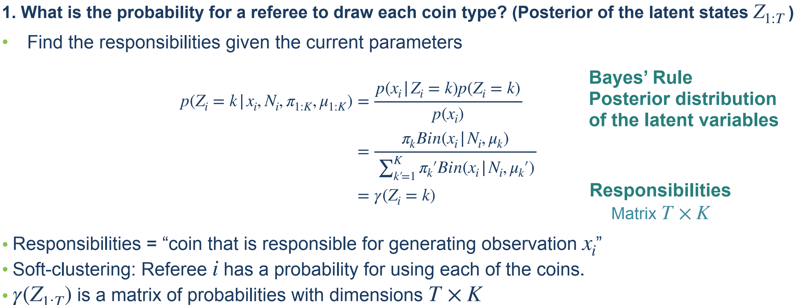
         
    - M-Step: Update parameters (learning)
    
        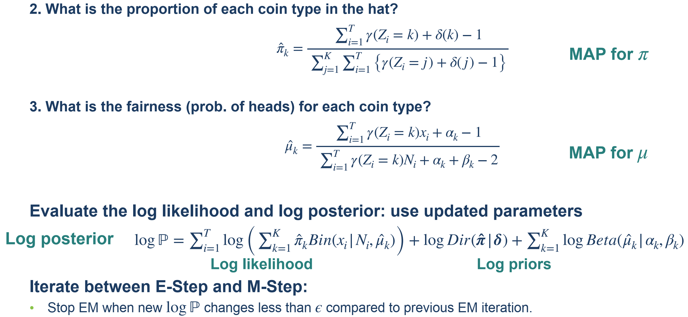
    
    
    Iterate between E-Step and M-Step: Stop EM when new $\log P$ changes less $\epsilon$ than compared to previous EM iteration

### Beta-Binomial Mixture Model

Beta prior distribution $p(\mu_k \mid \alpha_k, \beta_k) = Beta(\mu_k \mid \alpha_k, \beta_k)$
