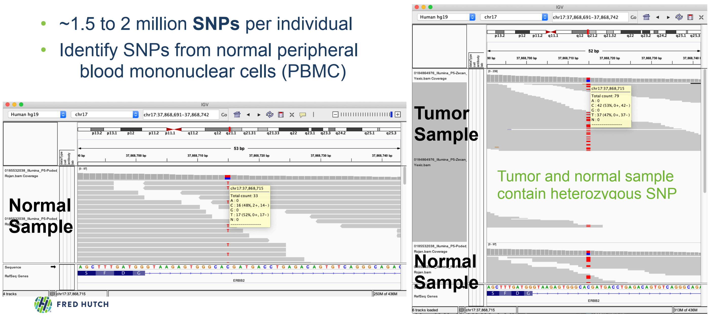
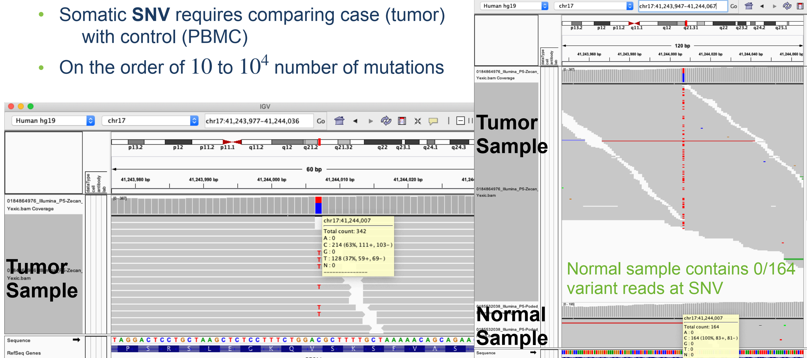
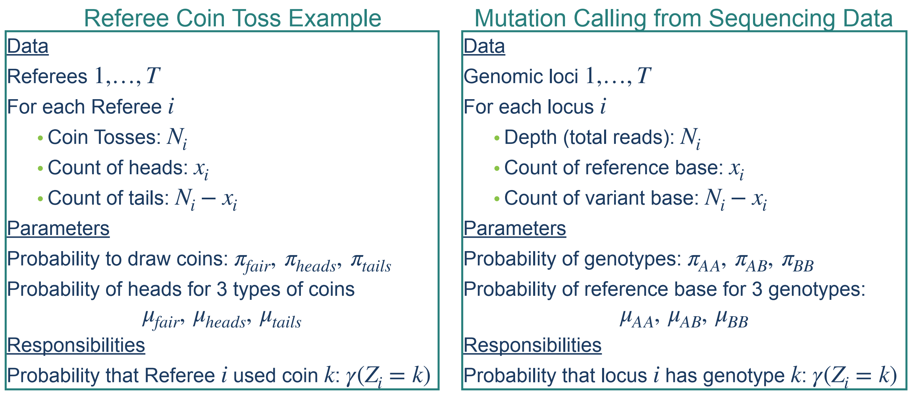
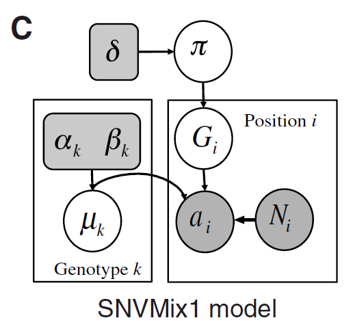
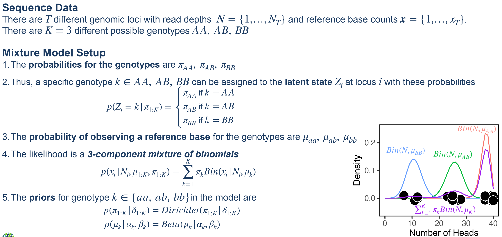
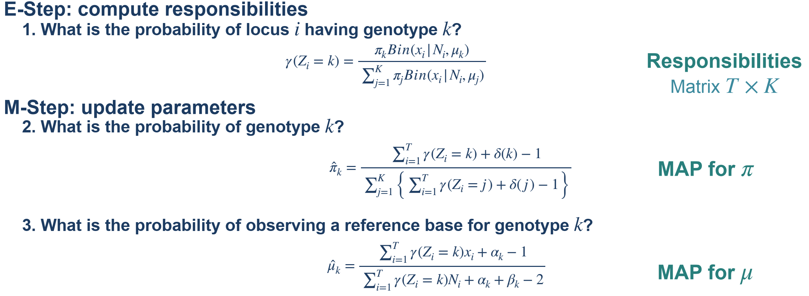
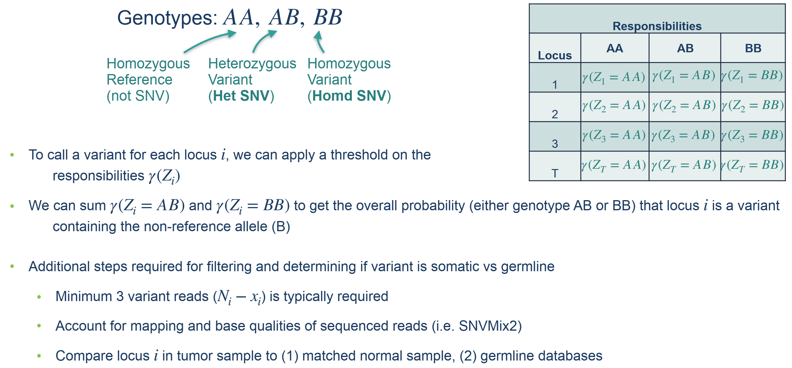
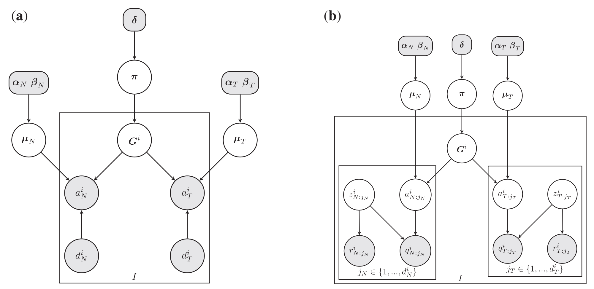
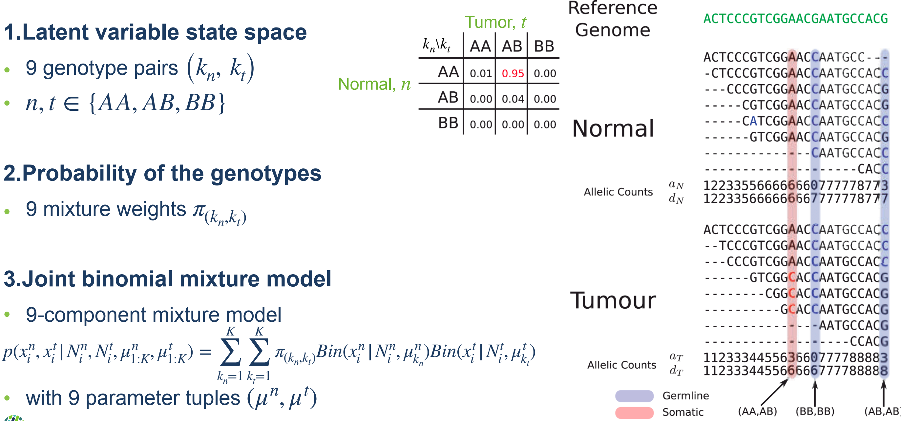

# 1. Detecting Mutations in Cancer Genomes

Germline SNVs

> ~1.5 to 2 million SNPs per individual
>
> Identify SNPs from normal peripheral blood mononuclear cells (PBMC)
>
> 

Somatic SNVs

> 

# 2. Mixture Models for SNV Detection

Mapping the Referee Example to Mutation Calling



## 2.1. SNVMix: germline mutation

### 2.1.1. probability model



where

$$\pi \mid \delta \sim \text{Dirichlet}(\delta) \\ Z_i \mid \pi\sim \text{Mutinomial}(\pi) \\ \mu_k \mid \alpha_k, \beta_k \sim \text{Beta}(\alpha_k, \beta_k) \\ x_i \mid \mu_k,Z_i=k \sim \text{Binomial}(N_i, \mu_k)$$



💡 Attention: it assumpts different genomic loci follow the same genotypes prior probabilities, is it reasonable?

### 2.1.2. Inference & parameter estimation using EM



### 2.1.3. Calling somatic SNVs from genotype inference



## 2.2. JointSNVMix: somatic mutation

Somatic SNV Detection using Joint Inference from Tumor-Normal Pairs





## 2.3. Homework 5: Single nucleotide variant genotyping

The input data is a text file `Homework5_alleleCounts.txt` that contains a set of 1000 loci with reference and non-reference allele counts

```r
chr position refBase refCount NRefBase NrefCount	depth
2   91822    C       42       N        2            44
2   202466	 C       36	      N        12	        48
2   274584	 C       40	      N        3	        43
```

your tasks are to implement the mixture model functions, implement and run the EM algorithm to convergence, and then annotate the mutation status for each locus

This assignment is divided into 4 parts:

1. Initial setup of the libraries and data

2. Implement the binomial likelihood model

3. Implement functions for the EM algorithm

4. Implement and run the full EM algorithm to learn the parameters and infer the genotypes.

### 2.3.1. Initial setup of the libraries and data

```r
# Load the input data
counts <- read.delim("Homework5_alleleCounts.txt", as.is = TRUE)
counts[1:2,]
## chr position refBase refCount NRefBase NrefCount depth
## 1 2 91822 C 42 N 2 44
## 2 2 202466 C 36 N 12 48

x <- counts$refCount
N <- counts$depth

# Initialize model parameters and hyperparameters
mu.init <- c(0.99, 0.5, 0.01)
pi.init <- c(0.80, 0.15, 0.05)
alpha.hyper <- c(10, 5, 1)
beta.hyper <- c(1, 5, 10)
delta.hyper <- c(8, 2, 2)
```

### 2.3.2. Implement functions for the Binomial Mixture Model

- 1\. Compute the observed binomial likelihood probabilities

    $$P(x_i \mid Z_i=k, N_i) = \text{Bin}(x_i \mid N_i, \mu_i)$$
    
    This function will compute the binomial probability for the input $x_i$ at each locus $i$ and (conditioned on) each genotype $k \in \{AA, AB, BB\}$
    
    ```r
    compute.binom.lik <- function(x, N, mu){
    
    }
    
    obs.lik <- compute.binom.lik(x, N, mu.init)
    obs.lik[1:5, ]
    
    ## AA AB BB
    ## [1,] 6.202536e-02 5.377387e-11 9.271746e-82
    ## [2,] 4.851809e-14 2.475124e-04 6.175313e-62
    ## [3,] 8.255780e-03 1.403009e-09 1.197446e-76
    ## [4,] 6.978069e-07 2.109893e-04 8.531618e-47
    ## [5,] 4.505405e-09 1.119110e-04 5.677071e-55
    ```

- 2\. Compute the log likelihood function

    $$P(x_{1:T} \mid N_{1:T}, \mu_{1:K}, \pi_{1:K}) \\ = \prod_{i=1}^T P(x_i \mid N_i, \mu_{1:K}, \pi_{1:K}) \\ = \prod_{i=1}^T \sum_{k=1}^K \pi_k \cdot \text{Bin}(x_i \mid N_i,\pi_k)\\ \ell = \log (P(x_{1:T} \mid N_{1:T}, \mu_{1:K}, \pi_{1:K})) \\ =  \sum_{i=1}^T \log \left( \sum_{k=1}^K \pi_k \cdot \text{Bin}(x_i \mid N_i,\pi_k)\right)$$
            
    ```r
    compute.loglik <- function(obs.lik, pi){
    
    }
    
    loglik <- compute.loglik(obs.lik, pi.init)
    loglik
    ## [1] -3993.978
    ```
            
### 2.3.3. Implement Functions for Genotype Inference and Parameter Estimation using EM

- 1\. Compute the responsibilities in the E-Step

    $$\gamma(Z_i=k) = \frac{\pi_k \cdot \text{Bin}(x_i \mid N_i, \mu_k)}{\sum_{j=1}^K \pi_j \cdot \text{Bin}(x_i \mid N_i, \mu_j)}$$
    
    ```r
    compute.responsibilities <- function(obs.lik, pi){
        # obs.lik, the likelihood (binomial probabilities) computed from compute.binom.lik
        # pi, the probability of the genotypes \pi_{1:K}
    
    }
    
    gamma <- compute.responsibilities(obs.lik, pi.init)
    gamma[1:3, ]
    ## [,1] [,2] [,3]
    ## [1,] 1.000000e+00 1.625561e-10 9.342696e-82
    ## [2,] 1.045455e-09 1.000000e+00 8.316505e-59
    ## [3,] 1.000000e+00 3.186425e-08 9.065209e-76
    ```
            
- 2\. Updating  parameters in the M-Step

    - the probability of genotypes (mixed weights) $\pi_{1:K}$
        
        computes the update of $\pi_k$ given the responsibilities $\gamma(Z_i)$ from the E-Step and the hyperparameter $\delta_k$
        
        $$\hat \pi_k = \frac{\left(\sum_{i=1}^T \gamma(Z_i=k)\right) + \delta(k)-1}{\sum_{j=1}^K\left[\left(\sum_{i=1}^T \gamma(Z_i=j)\right) + \delta(j)-1\right]}$$
        
        ```r
        update.pi <- function(gamma, delta){
            # gamma, the responsibilities computed from compute.responsibilities
            # delta, the hyperparameter for the Dirichlet prior, \delta_{1:K}
            
        }
        
        pi.hat <- update.pi(gamma, delta.hyper)
        pi.hat
        ## [1] 0.793479840 0.202007532 0.004512628
        ```
     
    - the binomial parameter $\mu_{1:K}$
        
        $$\hat \mu_k = \frac{\left(\sum_{i=1}^T \gamma(Z_i=k)x_i\right) + \alpha(k)-1}{\sum_{j=1}^K\left[\left(\sum_{i=1}^T \gamma(Z_i=j)N_i\right) + \alpha(j)-1\right]}$$
        
        ```r
        update.mu <- function(gamma, x, N, alpha, beta){
            # the responsibilities computed from compute.responsibilities
            # the input reference base counts x1:T
            # the input depth N1:T
            # the hyperparameters for the Beta prior, α1:K and β1:K
        }
        
        mu.hat <- update.mu(gamma, x, N, alpha.hyper, beta.hyper)
        mu.hat
        ## [,1] [,2] [,3]
        ## [1,] 0.9653329 0.6410865 0.1194937
        ```
   
- 3\. Compute the log posterior
    
    compute the log posterior distribution
    
    $$\log \mathbb{P} = $$
