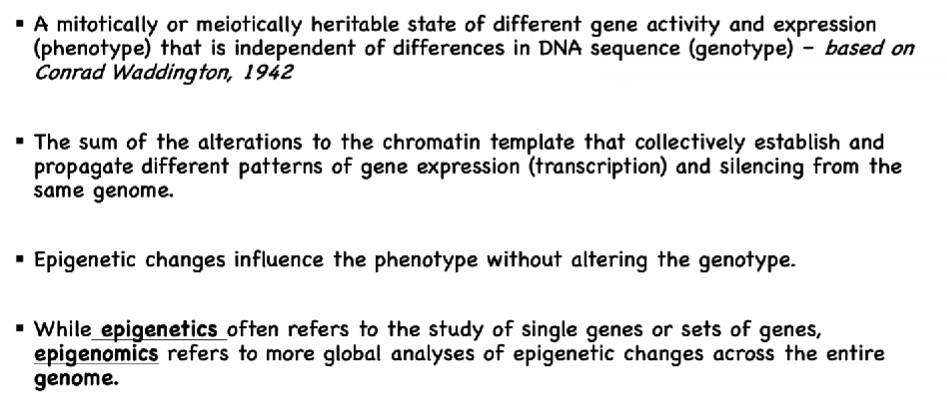
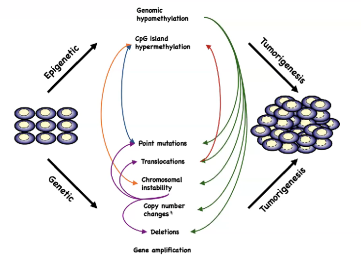

# 1. Intro to epigenetics and DNA methylation

## 1.1. a classic example in mice
        

        
the molecular mechanism behind this phenomenon
        

        
## 1.2. onco-exapation or epigenetic mutation
        
in fact in our genome, there are a lot of transposable elements like this, close 50% of sequences are actually derived from transposable elements, whereas only ~1.5% are protein coding

there are probably a lot of human diseases, that are due to kind of the same mechanism

the major mechanism of oncogene activation has been long studies and written in textbooks, there are **three mechanisms**, mutation, translocation and amplication, for cancer cells to upregulate their oncogenes

the forth mechanism: **epigenetic mutation**

onco-exaptation: the oncogenes are highly expressed, but this expression does not start from their canonical promoters, rather start from somewhere else, in this case a deregulated transposable element

onco-exaptation: from prognostic to cancer evolution

## 1.3. a classic example in honey bee

the molecular mechanism behind this phenomenon

## 1.4. what is epigenetics/epigenomics

there are many molecular mechanisms that enable epigenetics

## 1.5. what is DNA methylation

  
# 2. DNA Methylation Pattern and Function

## 2.1. two times of epigenetic reprogramming during development

after form zygote, the paternal and maternal genome undergoes DNA methylation in different ways

paternal genome: activate DNA demethylation, TET enzyme is involved

maternal genome: passive DNA demethylation, which is associated with cell cycle

by the time of pre-implantation, the genome of these cells are all demethylated except for some imprinted control regions

<aside>
❓ we know a lot is what happened globally, but we don’t know the specific mechanisms behind each step and how specific is achieved
</aside>

## 2.2. normal pattern of DNA methylation

DNA methylation is associated with gene expression and genome stability

 
# 3. DNA Methylation in Diseases

## 3.1. DNA Methylation in cancer

- **tumorgenesis is a process of interaction between genetics and epigenetics**

    
    
    epigenetic changes leads to genetic changes
    
    when genome wide hypomethylation, the **paracentral macro regions** are **losing the DNA methylation**, they’re filled with repeates, those repeats are actually perfect subjects for recombination, which led to **recombination** happen
    
    **increase DNA methylation over tumor suppressor genes**, for example DNA repair genes, will shut down DNA repair genes, then cancer cell start to accumulate mutations
    
    genetic changes leads to epigenetic changes
    
- **epigenetic event alone can lead to tumorgenesis**
    
    
    
    the chromatins form topologically associated with **domain seperated by doman boundaries**, usually bound by **CTCF**, which is actually a **methyl-sensitive protein**
    
    in **normal situation**, the CTCF binding sites are **unmethylated**, so CTCF can combined here, these **two domains are seperated**
    
    but in **cancer**, the CTCF binding sites’ **methylation level goes up**, then CTCF doesn’t bind anymore 
    
    as a result, these **two unrelated domains start to interact**, the enhancer in the left domain touches the oncogene in the right domain, resulting oncogene upregulation

- **aberrant DNA methylation in cancer**
    
    
    
    

- **epigenetic cancer therapy**
    
    
    
    this type of therapy is **not specific**, it doesn’t target tumor suppressor genes, it actually acts on the entire genome
    
    as a result, it’s not just the tumor suppressor genes getting expressed, the whole genome is getting transcribed
     
    the epigenetic therapy acutally primes cancer cells for **immune response**
    
    activated transcription on repeative regions, transcription goes through and end up getting RNA that can hybridize and form **double-stranded RNA**
    
    when the cell sense double-stranded RNA, regarded as a **viral infection** to activate immune process

## 3.2. DNA Methylation in other disease

imprinting disease: Angelman and Prader-Willi Syndromes

they are very kind of related, but phenotyoically the’re very different

it’s a genetic disease, so people have mapped where the problem is — these two diseases got mapped to this exactly same genetic event, the same deletion on chromosome 15, ~ 4Mb

how the same deletion results in two very different diseases ?

within this 4 Mb region, there two imprinted genes

        
# 4. Techniques to Measure DNA Methylation

- Enrichment based methods
    
    
    
    
    
- Restriction enzyme based methods
    
    
    
    
    
- Gold standard: Bisulfite based methods
    
    
    
    
    
    
    
    
    
    
    
- Direct reading of modified nuleotides

    
    
    
