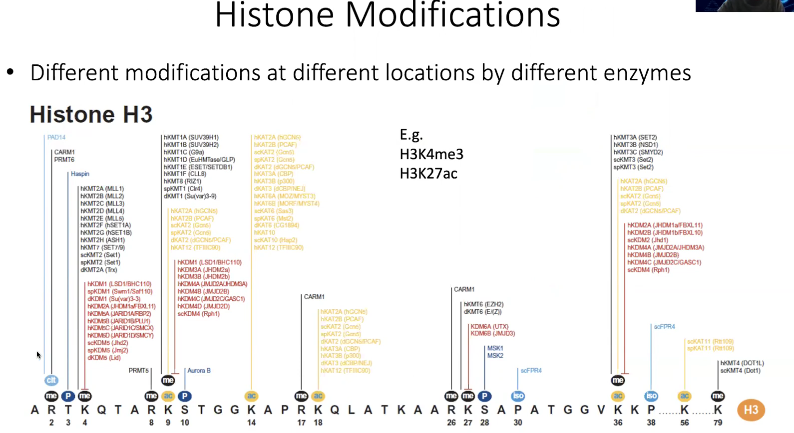

# 1. Nucleosome Positioning

in the reality, usually this experiment is done in millions of cells, in the different cells the nucleosome, it’s like a pearl on a necklace, they can slide around

when sequence this, you don’t always see a lot of peaks when the nucleosome are **not well positioned**, and the signal is kind of more **even**

but occasionally you would see a very **well positioned** nucleosome, which means across millions of cells, this nucleosome is always at this position

there are different factors that influence nucleosome positioning

## 1.1. cis-elements influencing nucleosome positioning

many animal species will have this **10 bp periodicity** which is the percentage of AA/TT/TA fraction

the DNA was wrapped around the nucleosome, and the DNA have a self-rotation in that double helix, as the DNA wrap around the eight histone, the double strand helix also have the self twisting in here

interestingly, the **GC** sequence actually prefer to interact with histone proteins **inside**, whereas the **AT** sequence does not like to face the histone proteins instead of facing **outside**

## 1.2. transcription factor influencing nucleosome positioning

in some regions in this case, there is a very strong **nucleosome free region**, the reason there is no nucleosome here is because the **polymerase** is a very strong transcription factor and it recruits many other transcription factors and co-factors to bind to this region — it will really **squeeze out the nucleosome**

because of this, the adjacent pearls on this necklace will also be kind of slightly better positioned 

<aside>
💡 the nucleosome positioning can influence transcription factor binding, but they are also influenced by transcription factors
</aside>

# 2. Histone Modifications

## 2.1. Introduction to Histone Modifications

with nucleosome as the basic unit, each of the nucleosome,  on the histones they also have little tails that’t kind of dangling outside

these tails can be modified, depend on the modification, which can be regarded as **beacons** in the genome, it can tell transcription factors where to go first

black: writer; red: eraser

##  2.2. Infer Transcription Factor Binding from Histone Mark Dynamics

### 2.2.1. histone modifications in relation to gene transcription

### 2.2.2. the interaction between epigenetics and transcription factor binding

this is really kind of a **chicken egg prblem**

epigenetics help transcription factors find where to go first

other transcription factors by working together or through these pioneering factors can also kick out the nucleosomes and add more marks to the nearby nucleosomes 

### 2.2.3. approach to find relevant **enhancers** and **transcription factors** & example

- approach
    
    read mapping (BWA), call peaks or differential peaks (MACS), and QC
    
    search for motifs from peaks, identify TF family
    
    calculate H3K27ac read-level **regulatory potential (RP)** to inform gene expr
    
    > combine motif searching and RP, you can guess which genes are active
    
    use H3K27ac ChIP-seq signals (sqrt or log) on TF binding to **weigh peaks**
    
    > previously in transcription factor ChIP-seq, whether the peak is a **10 fold versus 20 fold**, it probably tell you that the transcription factor is binding stronger to the region
    >
    > but in terms of regulating the nearby gene expression, the 20-fold peaks **don’t necessarily have a stronger effect** on the gene expression than the 10-fold peaks
    >
    > if you look at that particular peaks in a TF binding location, and the look at how much K27ac signal in this location, it does have effect
    
    overlap peaks with existing TF ChIP-seq data to find relevant TFs
    
    > the androgen receptor is important in prosate cancer, therefore we do androgen receptor ChIP-seq
    >
    > hopefully from this, you will find there are other transcription factors that might be important
    >
    > but what if we don’t know what transcription is imprtant for brain cancer. what you can do is to get the brain cancer tissue and then you just do K27ac ChIP-seq
    >
    > based on the peaks overlap with all the known transcription factor, it call tell you whch TF is really important in brain cancer
 
- example
    
    progenitor cells vs. differentiated cells in small intestine
    
    
    
    Verzi MP, Shin H, He HH, et al. Differentiation-specific histone modifications reveal dynamic chromatin interactions and partners for the intestinal transcription factor CDX2. *Dev Cell*. 2010;19(5):713-726. doi:10.1016/j.devcel.2010.10.006
            
## 2.3. Using Histone Marks to Infer Gene Functions

### 2.3.1. use histone markers to identify **new (e.g. lncRNA) genes**

  
### 2.3.2. use histone markers to identify **bivalent genes**

H3K4me3 is a active mark, while H3K27me3 is a repressive mark

these regions are important, they not only have a on switch, they also have off switch

but just in case that the on/off is not tightly regulated, in order to ensure the on/off are tightly regulated 

in ES cells initially is bivalent, it has both active and repressive marks

but as the cell differentiate, if this factor become really on, what will happen is that eventually this gene will only H3K4me3 (active mark) and the H3K27me3 will be erase; otherwise, if this factor become really off, H3K4me3 will be erase

### 2.3.3. use histone markers to identify **super enhancers**

the genes that are near these super enhancers turn to have very importanct functions

for example, if you look at the gene expression between breast cancer and normal breast epithelial cells, there are many genes that are upregulated

estrogen receptor is by no means a very highly overexpressed genes, because in general the transcription factors are not expressed at high levels

but interestingly, when you look at the epigenetics on the K27ac signal , you will see huge K27ac peaks near the estrogen receptor gene

### 2.3.4. use histone markers to identify **super promoter**

